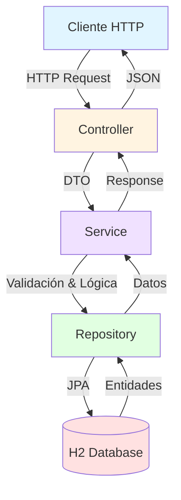

# API de Registro de Usuarios

API REST para registro y gestión de usuarios desarrollada con Spring Boot para BCI.

## Tecnologías

- **Spring Boot** 2.7.18
- **Java** 8
- **Maven** 3.6+
- **H2 Database** (en memoria)
- **JWT** para autenticación
- **Swagger/OpenAPI** para documentación

## Requisitos Previos

- **JDK 8** o superior
- **Maven 3.6+**
- **Puerto 8080** disponible

## Instalación y Ejecución

### 1. Compilar el proyecto
```bash
mvn clean install
```

### 2. Ejecutar la aplicación
```bash
mvn spring-boot:run ( o ejecutar desde el mismo ide )
```

La aplicación estará disponible en: 
`http://localhost:8080`

Pero las apis son las siguientes
`http://localhost:8080/api/users/` y `http://localhost:8080/api/users/sign-up`

Se recomienda ir directo a swagger

`http://localhost:8080/swagger-ui.html`


## Arquitectura

### Diagrama de Capas



## Modelo de Datos

```

    USER {
        uuid id PK
        string name
        string email UK
        string password
        timestamp created
        timestamp modified
        timestamp lastLogin
        string token
        boolean isActive
    }
    PHONE {
        long id PK
        string number
        string citycode
        string contrycode
        uuid user_id FK
    }
```

## Endpoints

### 1. Registrar Usuario

**POST** `/api/users/sign-up`

**Request:**
```json
{
  "name": "Juan Pérez",
  "email": "juan.perez@example.com",
  "password": "Password123",
  "phones": [
    {
      "number": "987654321",
      "citycode": "1",
      "contrycode": "57"
    }
  ]
}
```

**Response (200 Ok):**
```json
{
  "id": "a1b2c3d4-e5f6-7890-abcd-ef1234567890",
  "created": "2025-12-03T10:30:00",
  "modified": "2025-12-03T10:30:00",
  "lastLogin": "2025-12-03T10:30:00",
  "token": "eyJhbGciOiJIUzI1NiIsInR5cCI6IkpXVCJ9...",
  "isActive": true
}
```
## Validaciones

### Email
- **Formato:** `^[A-Za-z0-9+_.-]+@[A-Za-z0-9.-]+\.[A-Za-z]{2,}$`
- **Ejemplo válido:** `usuario@dominio.com`

### Contraseña
- **Formato:** `^.{6,}$`
- **Mínimo:** 6 caracteres

### Errores Comunes

**400 Bad Request - Email inválido:**
```json
{
  "mensaje": "El formato del email no es válido"
}
```

**409 Conflict - Email duplicado:**
```json
{
  "mensaje": "El correo ya está registrado"
}
```

**400 Bad Request - Contraseña inválida:**
```json
{
  "mensaje": "La contraseña debe tener al menos 6 caracteres"
}
```

## Consola H2
Acceso a la base de datos:
```
URL: http://localhost:8080/h2-console

JDBC URL: jdbc:h2:mem:userdb

Usuario: sa

Contraseña: (vacío)

```

## Ejecutar Tests

```bash
# Ejecutar todos los tests
mvn test

# Ejecutar con reporte de cobertura
mvn clean test
```

### Tests Incluidos

- **UserControllerTest**: Tests de endpoints
  - Registro exitoso (201)
  - Email duplicado (409)
  - Email inválido (400)
  - Campos requeridos (400)

- **UserServiceTest**: Tests de lógica de negocio
  - Validación de email
  - Validación de contraseña
  - Excepción de email duplicado

- **JwtServiceTest**: Tests de JWT
  - Generación de tokens
  - Validación de tokens
  - Extracción de email


## Estructura del Proyecto

```
src/main/java/com/bci/userregistration/
├── controller/          # Controladores REST
├── service/            # Lógica de negocio
├── repository/         # Acceso a datos
├── entity/             # Entidades JPA
├── dto/                # Data Transfer Objects
├── exception/          # Manejo de excepciones
└── config/             # Configuración
```

## Autor

Proyecto desarrollado para BCI
